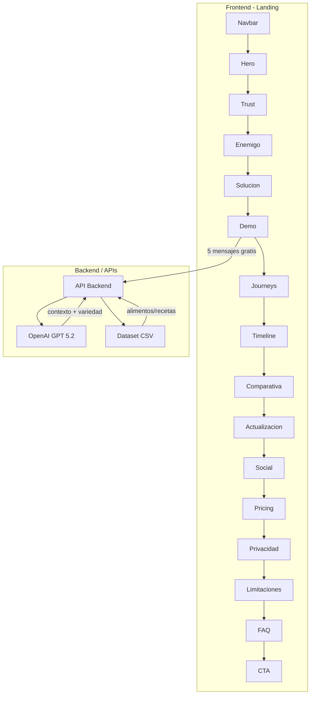
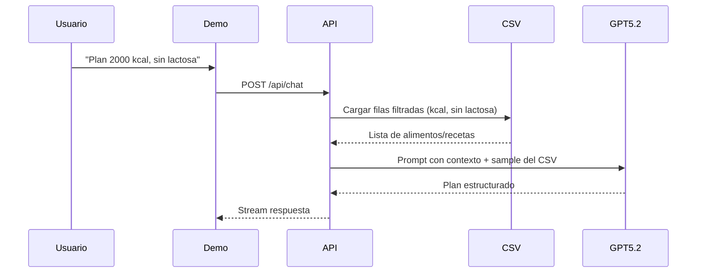

# Plan: Landing de Asistente de Planes Alimenticios con IA

## Resumen del proyecto

Aplicación web (landing + chat funcional) para un asistente que genera planes alimenticios personalizados usando **GPT 5.2** y un **dataset CSV** depurado. El mapa de página se adapta al nicho nutricional manteniendo la estructura de conversión.

---

## Arquitectura general




---

## Stack tecnológico recomendado


| Capa      | Tecnología                           | Razón                                                     |
| --------- | ------------------------------------ | --------------------------------------------------------- |
| Frontend  | Next.js 14+ (App Router)             | SSR, rutas, buen SEO para landing                         |
| Estilos   | Tailwind CSS                         | Rapidez, diseño responsive                                |
| Chat/Demo | Componente React + streaming         | Integración directa con API                               |
| Backend   | Next.js API Routes o Python FastAPI  | Seguridad de API keys, lógica de negocio                  |
| CSV       | Leído en servidor (pandas o similar) | El CSV alimenta el contexto del prompt                    |
| IA        | OpenAI API (modelo `gpt-5.2`)        | Variantes: Instant (rápido) o Thinking (más razonamiento) |


---

## Mapa de página adaptado a planes alimenticios


---

### **1. Navbar sticky**

- Logo profesional y reconocible.
- Navegación intuitiva: Cómo funciona · Planes nutricionales · Precios · FAQ.
- Botones destacados: **"Prueba gratis"** y **"Iniciar sesión"**.
- Fondo elegante (#0D0D0D) con scroll suave.
- En móvil, menú hamburguesa y botón “Prueba gratis” siempre visible para facilitar acción.

---

### **2. Hero**

- Etiqueta poderosa: *"El nutricionista experto que usa la información nutricional real de Mercadona"*.
- Titular claro y diferenciador: **"Tu asesor personal que crea planes nutricionales precisos basados en productos auténticos de Mercadona"**.
- Subtítulo que resalta valor: *"Diseña planes personalizados que combinan rigor científico y datos reales de valores nutricionales, para comer sano sin complicaciones."*
- Mensaje con urgencia sutil: *"Cada día sin un plan a medida es una oportunidad desperdiciada para mejorar tu salud y bienestar."*
- Mockup dinámico mostrando diálogo: Usuario solicita plan semanal balanceado; asistente responde con menús variados basados en el CSV con datos nutricionales.
- Llamados a la acción destacados: **"Comienza 3 días gratis"** y **"Ver demo rápida"**.

---

### **3. Barra de confianza**

- Métricas reales que generan credibilidad:  
*"+3000 planes generados · +200 alimentos con datos nutricionales precisos · Datos actualizados al detalle · Valoración 4.9/5 · +2500 usuarios satisfechos"*.
- Animaciones count-up para dar dinamismo al hacer scroll.

---

### **4. Bloque del enemigo**

- Título que impacta: **"Olvida los planes genéricos que no consideran la calidad real ni los valores nutricionales fiables"**.
- Cards que exponen las limitaciones comunes:
  - Apps nutricionales con datos imprecisos o incompletos.
  - Asistentes genéricos que no usan datos verificados.
  - Consejos imprecisos alejados del conocimiento científico.
  - Fuentes aleatorias sin personalización ni respaldo nutricional.

---

### **5. Qué es y cómo funciona**

- Tres pasos claros y atractivos:
  1. **Explícale tus objetivos, estilo de vida y restricciones.**
  2. **Recibe planes detallados y balanceados basados en datos reales de nutrientes y calorías de alimentos disponibles en Mercadona.**
  3. **Ajusta y personaliza fácilmente con seguimiento continuo y recomendaciones prácticas.**

---

### **6. Demo interactiva**

- Chat embebido funcional con sandbox de **5 mensajes gratis** para probar sin compromiso.
- Prompts de ejemplo que enfatizan planes basados en valor nutricional:
  - "Plan para ganar masa muscular con alimentos de Mercadona"
  - "Semana sin lactosa: opciones con valores nutricionales completos"
  - "Menús para bajar grasa con equilibrio calórico".
- GPT-5.2 integrando datos reales del CSV para asegurar precisión y variedad nutricional.
- CTA al agotar mensajes: desbloquea acceso ilimitado con scroll directo a precios.

---

### **7. Casos de uso (Journeys)**

- Tabs con escenarios nutricionales reales:
  - Primer plan personalizado.
  - Ajustes macro nutricionales según progreso.
  - Opciones sin lactosa, sin gluten y veganas con datos completos.
  - Preparación semanal inteligente (batch cooking).
  - Revisión y adaptación basada en evolución nutricional.
- Ejemplos con mini conversaciones que muestran fluidez, conocimiento y utilidad.

---

### **8. Timeline antes y después**

- Visualiza la transformación en tiempo real:
  - Día 1: Definición personalizada de metas y perfil.
  - Días 2-3: Plan nutricional detallado fundamentado en datos de Mercadona.
  - Semana 1: Ajustes y mejoras personalizadas.
  - Mes 1: Potenciación nutricional con planes optimizados y resultados palpables.

---

### **9. Comparativa**

- Tabla directa y sencilla:
  - Apps genéricas sin datos precisos · Asistentes estándar sin actualización · Nuestro asistente con nutrición validada y datos reales de Mercadona.
- Criterios: precisión nutricional, personalización, actualización, memoria y accesibilidad 24/7.

---

### **10. Actualización continua**

- Integra diariamente nuevos datos nutricionales oficiales.
- Incluye mejoras y funciones basadas en feedback real de usuarios.
- Evoluciona y mejora con cada interacción.

---

### **11. Social proof**

- Testimonios auténticos y enfocados:
  - "Planificado exactamente con la info nutricional que necesito, fácil y real."
  - "Conocimiento profundo y práctico, combinando nutrición y productos concretos."

---

### **12. Pricing**

- Plan Básico: ideal para usuarios ocasionales con límite en creaciones.
- Plan Pro: acceso total, historial detallado, exportación y recomendaciones avanzadas.
- Opción de pago mensual o anual con ahorro visible.

---

### **13. Privacidad**

- Seguridad y confianza:
  - No compartimos ni vendemos datos personales.
  - Cifrado total de interacciones y datos sensibles.
  - Borrado de historial simple y rápido en cualquier momento.

---

### **14. Limitaciones honestas**

- No sustituto del diagnóstico médico profesional para patologías.
- Basado en datos oficiales de valor nutricional, no en stock o precios.
- Recomendado consultar especialistas para casos clínicos complejos.

---

### **15. FAQ, CTA final y Footer**

- FAQs comprensibles y directas para resolver todas las dudas importantes.
- Popup exit intent con oferta suave para captar conversiones.
- Botón fijo “Prueba gratis” en móvil, siempre accesible para facilitar la acción.

---

## Integración GPT 5.2 + CSV

### Flujo de datos




### Estructura esperada del CSV

Columnas mínimas sugeridas (ajustables según tu dataset):

- `nombre`, `categoria` (desayuno/comida/cena/snack), `kcal`, `proteinas`, `grasas`, `carbohidratos`
- `restricciones` (vegano, sin_gluten, sin_lactosa, etc.)
- `porciones` o `raciones`

El backend filtra filas del CSV y las inyecta en el prompt para que GPT 5.2 genere planes variados basados en datos reales.

### Ejemplo de prompt (seudo-código)

```
Contexto: El usuario quiere [objetivo]. Restricciones: [restricciones].
Base de alimentos disponibles (muestra del dataset):
[csv_sample como texto o JSON]

Genera un plan de 7 días variado. Usa SOLO o principalmente alimentos de la lista.
Formato: Día X - Comida - [nombre], [porción], macros.
```

---

## Estructura de carpetas del proyecto

```
proyecto-planes-alimenticios/
├── .cursorrules          # Kit Rune-stone (opcional)
├── AGENTS.md
├── specs/                # Contratos .rune (si usas Rune-stone)
├── src/
│   ├── app/
│   │   ├── layout.tsx
│   │   ├── page.tsx      # Landing
│   │   └── api/
│   │       └── chat/
│   │           └── route.ts
│   ├── components/
│   │   ├── Navbar.tsx
│   │   ├── Hero.tsx
│   │   ├── DemoChat.tsx
│   │   ├── Pricing.tsx
│   │   └── ... (resto de secciones)
│   └── lib/
│       ├── openai.ts
│       └── csv-loader.ts
├── data/
│   └── alimentos.csv     # Dataset depurado
├── public/
└── package.json
```

---

## Orden de implementación sugerido

1. **Setup:** Next.js + Tailwind + estructura de carpetas. Copiar Kit Rune-stone si quieres metodología.
2. **Contrato inicial:** Si usas Rune-stone, primer `.rune` para "Generación de plan alimenticio v1".
3. **Backend:** API route `/api/chat` que carga CSV y llama a GPT 5.2.
4. **Hero + Navbar + Trust:** Primeras secciones visibles.
5. **Demo Chat:** Componente que consume la API (5 mensajes gratis).
6. **Resto de secciones:** Enemigo, Cómo funciona, Journeys, Timeline, Comparativa, etc.
7. **Pricing, Privacidad, Limitaciones, FAQ, Footer.**
8. **Pulido:** Exit intent, sticky CTA mobile, animaciones count-up, refinado visual.

---

## Decisiones previas a implementar

- **Ubicación:** Crear carpeta nueva (ej. `e:\proyectos\PlanesAlimenticios`) o dentro de la Fábrica.
- **Dataset CSV:** Confirmar columnas exactas; si no existe, definir contrato `.rune` para el formato.
- **API key:** Configurar `OPENAI_API_KEY` en variables de entorno (nunca en código).
- **Modelo exacto:** `gpt-5.2-instant` (rápido) o `gpt-5.2-thinking` (más elaborado). Instant suele bastar para chat en tiempo real.

---

## Próximos pasos

1. Decidir ruta del proyecto y si se usa Rune-stone.
2. Compartir estructura (o ejemplo) del CSV para validar integración.
3. Ejecutar Paso 1 del plan (setup + primer contrato o endpoint de chat).

